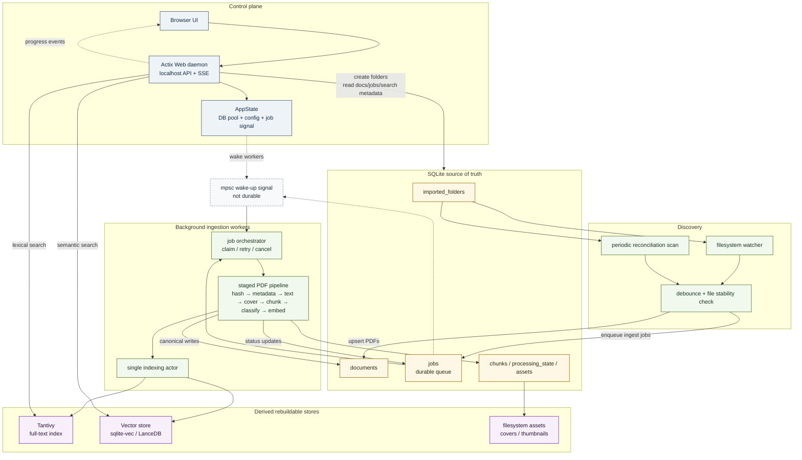

# papercache

Your research library, indexed where it lives. Local-first. Single binary. Built with love in Rust.

## Development

```bash
make watch
# make build
```

- Visit [localhost:3141](http://localhost:3141/)

## Why?

I have thousands of PDF papers on my computer which are unfortunately mostly unorganized. I want a more effective solution for automatically organizing and classifying my document collection. So I've started `papercache`. The idea is to create something lightweight that will run locally as background daemon 24/7 which indexes at night, or when requested, so the local models I use via `LMStudio` for classification/RAG/etc don't use up all the compute I have when I'm busy with developing other things. I'm already running WakApi as a background daemon for tracking my coding time and I quite like this pattern.

## What?

Papercache is an event-driven PDF ingestion pipeline with a persistent job queue. Actix handles the UI/API. PDF ingestion runs in separate async/blocking workers coordinated through durable state.

In plain terms, `papercache` is a small local service that watches folders you choose and builds a searchable library from the PDF papers already on your computer. It does not move or reorganize your files. Instead, it records where each PDF lives, extracts text from it, breaks that text into searchable chunks, creates a simple cover image, classifies the document with deterministic starter rules, and stores the results in a local SQLite database and Tantivy full-text index.

The app is designed to run as a background daemon on your own machine. By default it listens only on `127.0.0.1:3141`, stores its data under the platform app-data directory, and can be pointed somewhere else with `--data-dir`. API writes require a local auth token generated on first startup and sent as `Authorization: Bearer <token>`, so accidental writes from unrelated local pages are harder to trigger. The token is written to `token.json` in the data directory, and can also be printed in startup logs with `--show-token`.

The current implementation includes the backend pieces needed for a first working loop:

- Add a folder with `POST /api/folders`.
- Scan that folder for PDFs, skipping common hidden or noisy directories.
- Persist discovered folders, documents, chunks, assets, jobs, and settings in SQLite.
- Queue ingestion work durably so interrupted jobs are retried on restart.
- Extract PDF text, chunk it, classify it with `rules-v1`, and mark documents ready or failed.
- Keep a Tantivy index updated through a single writer task.
- Search indexed chunks with `POST /api/search`.
- Read document metadata, cover images, and original PDFs through document-scoped API routes.
- Subscribe to progress updates through `GET /api/events` using Server-Sent Events.

The code is still intentionally MVP-shaped. Cover rendering currently writes a generated placeholder image, classification is rule-based, and vector search is represented in the architecture but not yet part of the implemented request path.

### Architecture


